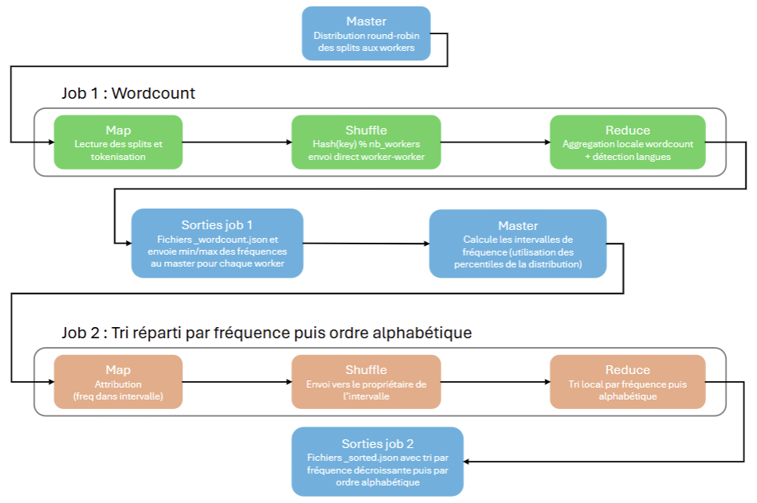
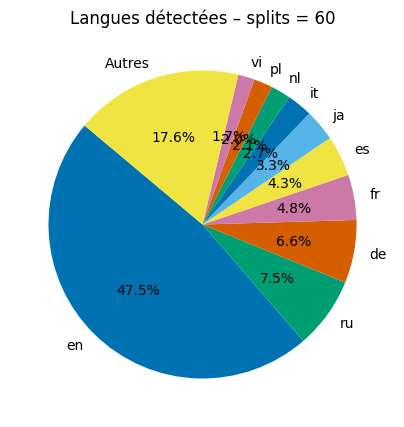
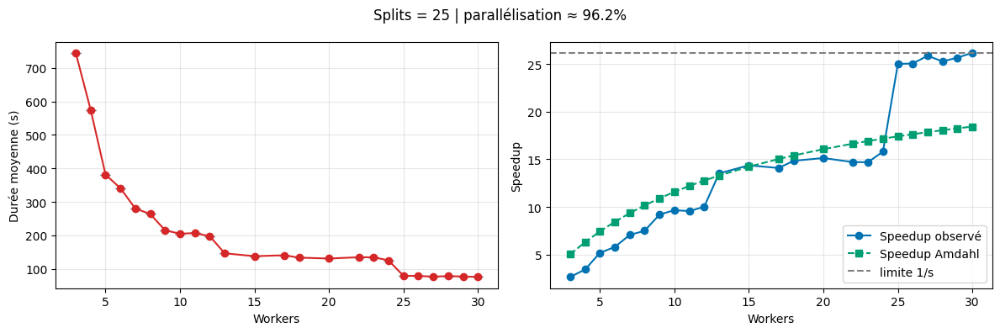
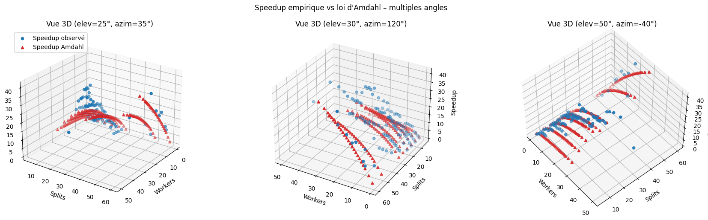

# Projet MapReduce « fait maison » – Télécom Paris

*Le rapport complet est à consulter à la racine du dépôt : **report.pdf.***

Ce dépôt décrit un système MapReduce « fait maison » développé en Python pour les machines de Télécom Paris. Deux objectifs principaux : (i) un protocole master/workers TCP avec shuffle pair-à-pair, sans transit de données applicatives par le master, (ii) une expérimentation de la loi d'Amdahl en faisant varier le nombre de workers et de splits sur un corpus CommonCrawl (wordcount puis tri réparti).

---

## Architecture et pipeline

Le master distribue les splits en round-robin. Les workers exécutent Map → Shuffle → Reduce en pair-à-pair et stockent les résultats sur NFS. Un second job trie les mots par fréquence puis ordre alphabétique à partir des wordcounts.

---

## Expérimentation de la loi d'Amdahl

La loi d'Amdahl est ajustée sur les mesures (temps Map+Shuffle+Reduce) issues des benchmarks. Le fit empirique montre une fraction parallélisable très élevée, renforcée par l'usage du multi-cœurs sur chaque worker (jusqu'à 12 cœurs, soit jusqu'à 720 processus en parallèle avec 60 workers).

---

## Analyse des langues

Le wordcount intègre une détection de langue. Les occurrences sont dominées par l'anglais, puis quelques langues majeures (ru, de, fr, es), le reste formant une longue traîne.

---

## Pour aller plus loin

Des expériences supplémentaires varient le nombre de splits indépendamment du nombre de workers. On observe des « marches d'escalier » du speedup : dès que les splits sont un multiple des workers, la charge s'équilibre et le speedup saute. Les splits sont atomiques et attribués en round-robin, donc un split supplémentaire déséquilibre un worker tant qu'on n'atteint pas un multiple.

Une vue 3D illustre la loi d'Amdahl sur trois dimensions : nombre de workers, nombre de splits (quantité de données) et speedup.

---

## Points clés

- Protocole TCP : master qui coordonne, workers qui lisent/écrivent sur NFS, shuffle pair-à-pair par hachage des clés.
- Deux jobs MapReduce complets : wordcount enrichi (langdetect) puis tri réparti par fréquence/ordre alphabétique.
- Parallélisme inter- et intra-nœuds (multi-cœurs) pour pousser la fraction parallélisable.
- Benchmarks structurés (`results.jsonl`, `benchmarks/results.jsonl`) pour l'ajustement à la loi d'Amdahl.
- Scripts d'orchestration : `scripts/run_cluster.py`, `scripts/benchmark_cluster.py`, `scripts/results_summary.py`.
